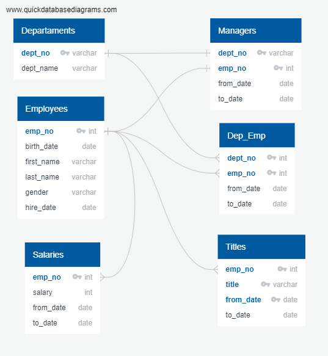
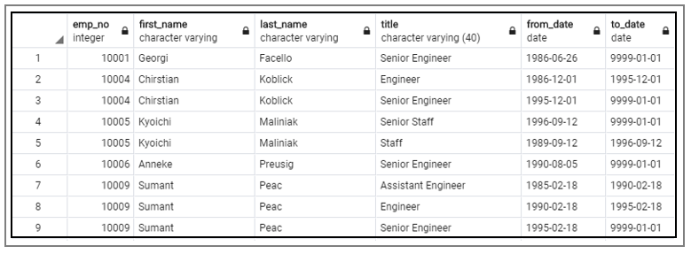
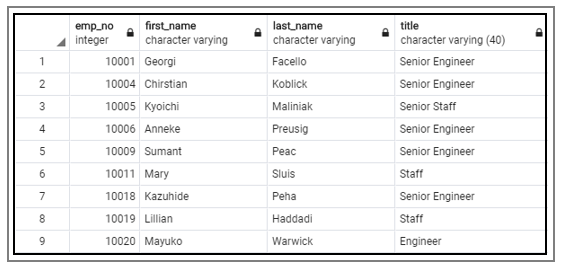
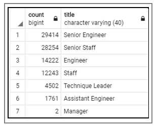
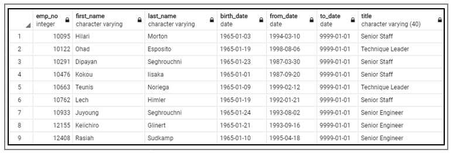
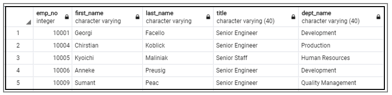
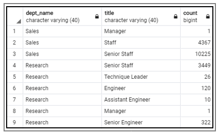
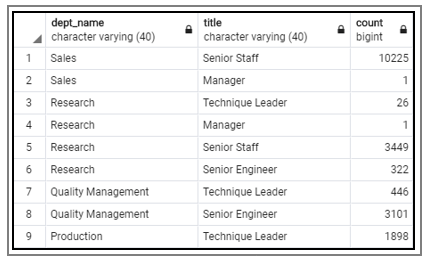

# Pewlett-Hackard Analysis
*An SQL HR-Department Analysis*

## Project Overview 
### Purpose
The purpose of this analysis is to prepare Pewlett-Hackard, a company with several thousand employees, for the upcoming “silver tsunami”. A large number of employees will begin retiring at a rapid rate in the next few years and the company wants to be prepared with the retirement packages, open positions and employees’ training. In order to ensure a smooth transition this analysis focuses on the following: 

1.	Identify the retiring employees by their title.
2.	Determine the sum of retiring employees grouped by title.
3.	Identify the employees eligible for participation in the mentorship program.
4.	Determine the number of roles-to-fill grouped by title and department.
5.	Determine the number of qualified, retirement-ready employees to mentor the next generation grouped by title and department.

  

### Background
The data is gathered in six CSV files and the analysis is performed using relational databases. In this analysis I am using:
- **QuickDBD** to create quick database design for better visualization,
- **PostreSQL** a database system to load, build and host company’s data, and 
- **pgAdmin** a GUI, using SQL Language to explore, manipulate and extract the data. 

As a part of **data modeling** and **data engineering** the fundamental knowledge of constraint rules and awareness of “dirty data” that is flawed and require extensive cleaning is very important. A section in the module summarizes few rules when building the database:

> A constraint is a rule that is applied to a column in a SQL table. It will limit the data in a way that provides more accuracy and reliability when working with it. The unique constraint implies that the data in that column is unique. This ensures that if the table were to be updated in the future, nothing will be duplicated (1). 

Building clean and organized database with good foundation is essential in order to prevent further anomalies and errors. 

## Resources
Data Source:
-	[Six csv files](Data_Source/)

Software:
-	PostreSQL
-	pgAdmin 4
-	Quick DBD

## ERD and Schema

**ERD**
An entity-relationship diagram (ERD) is crucial to creating a good database design. It is used as a high-level logical data model, which is useful in developing a conceptual design for databases.

  

  
<i>Figure 1: ERD</i>

**Schema**
A [schema](Queries/schema.sql) is a blueprint or architecture of how data will look. It is a description of the actual construction of the database, an all-encompassing term that refers to the collective of tables, columns, triggers, relationships, key constraints, functions and procedures. Schemas are important for designig database management systems (DBMS) or relational database management systems (RDBMS). 

## Results  

**1.	The list of retiring employees**
-	The table includes employee number, first name, last name, title, from-date and to-date.
-	The query returns 133,776 rows. 
-	The table displays a list of employees who is going to retire in the next few years.
-	The list is long and extensive, yet at-a-glance analysis gives us some insights about the query. Some employees appear more than once due to change of title during their career at Pewlett-Hackard.

  

  
<i>Figure 2: Table with the employee’s data that are retirement-ready</i>

  **Overview of the code**
  
To retrieve the data, two tables were merged together - employees and titles - with the `inner join` and filtered by birth date, that indicates who is about to retire in the next few years with the command `WHERE (e.birth_date BETWEEN '1952-01-01' AND '1955-12-31')`. 

:exclamation: The query has one drawback. It contains all the titles that employees acquired while working at Pewlett-Hackard over the years. This resulted in duplicates, some employees appear two times or more; therefore, the number of retiring employees (133,776) is huge and incorrect.

**2.	The list of retiring employees without duplicates**
-	The table includes employee number, first name, last name, title, from-date and to-date.
-	The query returns 90,398 rows. 
- The table displays a list of employees who are going to retire in the next few years.
-	In the table each employee is listed only once, by her or his most recent title.

  

  
<i>Figure 3: Table with the employee’s data that are retirement-ready without duplicates</i>

**Overview of the code**

Query contains the same data as the query above with addition of `distinct_on` command that kept only unique values. To ensure that most recent values are kept, I used command `ORDER BY rt.emp_no, rt.to_date DESC` to sort the data by descending order on the `to_date` column. In this case the most recent title was listed first, and after running the query the duplicates listed after the first appearance of the same employees were removed.

**3.	The number of retiring employees grouped by title**
-	The table includes employees’ titles and their sum. 
-	The query returns a cohesive table with 7 rows.
-	From this table we can quickly see how many employees with certain title will retire in the next few years.

  

  
<i>Figure 4: Table with the employee grouped by title</i>

**Overview of the code**

In order to retrieve this table I used `GROUP BY ut.title` command, and it is responsible for grouping the rows by titles. Next, I used its corresponding command `COUNT (ut.title)` that counts how many times specific title appears in the database. 

**4.	The employees eligible for the mentorship program**
-	The table contains employee number, first name, last name, birth date, from date, to date and title. 
-	The query returns 1,549 rows.
- The table displays a list of employees who is eligible for the mentorship program.

  

  
<i>Figure 5: Table with the employee grouped by title</i>

**Overview of the code**

To retrieve this data, three tables were merge together: employees, titles and dep_emp with the `inner join`. The query filters by birth date (that indicates who is eligible for the mentorship program) with the command ` WHERE (e.birth_date BETWEEN '1952-01-01' AND '1955-12-31') ` and `to_date`  to include only current employees. Duplicates were removed by `DISTINCT ON (e.emp_no)` command. To ensure I got the most recent titles, I used `ORDER BY e.emp_no, ti.from_date DESC` command.

:exclamation: Please see full reports in CSV files [here](Data/) and SQL Queries [here](Queries/Employee_Database_challenge.sql) - **see Deliverable  1 & 2**.

## Summary

As the company is preparing for the upcoming "silver tsunami" a good planning is essential, especially when such a large number of the employees is involved. Reports above give a good insight about the number of the employees that are about to retire and hold specific title. However, I believe that additional break down per department will be beneficial for the company. In this case headquarters can see what to expect in each department separately. In order to retrieve department name information, I merged additional table `departments` into existing table `retirement_titles` with the `inner join`. After removing the duplicates, with `DISTINCT ON` command, the table was ready to be used for additional queries.

  

  
<i>Figure 6: Table with retirement-ready employee’s data with added department name</i>

:exclamation: Please see full report [here](Data/) - **see 05_Extra_unique_titles_department.csv** and SQL Queries [here](Queries/Employee_Database_challenge.sql) - **see Deliverable 3**.

***How many roles will need to be filled as the "silver tsunami" begins to make an impact?*** 
The table **retirement titles** contains all the information about the employees that are about to retire in the next four years. To get the number of positions that will be open in next four years I ran additional query that breaks down how many staff will retire per department. Since every department will be affected in some way this query gives more precise numbers what each department can expect and how many roles will need to be filled.

  

  
<i>Figure 7: Sum of retirement-ready employees group by title and department.</i> 

:exclamation: Please see full report [here](Data/06_Extra_roles_to_fill.csv) and SQL Queries [here](Queries/Employee_Database_challenge.sql) - **see Deliverable 3**.

***Are there enough qualified, retirement-ready employees in the departments to mentor the next generation of Pewlett-Hackard employees?*** 
To ensure that are enough qualified staff for training at Pewlett-Hackard I ran a query with additional filter, that returns only employees on higher positions, assuming that those are qualified as mentors. With the command ` WHERE ut.title IN ('Senior Engineer', 'Senior Staff', 'Technique Leader', 'Manager') ` the results include only staff on higher positions. From the table we can see how many qualified employees are in each department to train next generation. 

  

  
<i>Figure 8: Sum of qualified, retirement-ready employees group by title and department</i>

:exclamation: Please see full report [here](Data/07_Extra_qualified_staff.csv) and SQL Queries [here](Queries/Employee_Database_challenge.sql) - **see Deliverable 3**.

## References
(1) Module 7. Create Tables in SQL, https://courses.bootcampspot.com/courses/200/pages/7-dot-2-2-create-tables-in-sql?module_item_id=72739, Trilogy Education Services, 2000, Web 27 Aug 2020.

## Other Useful Articles

-	[Composite Key]( https://www.javatpoint.com/sql-composite-key#:~:text=A%20composite%20key%20is%20a,it%20does%20not%20guarantee%20uniqueness)

-	[Primary & Foreign Keys]( https://www.youtube.com/watch?v=B5r8CcTUs5Y)

